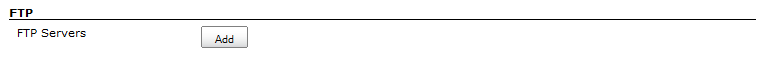
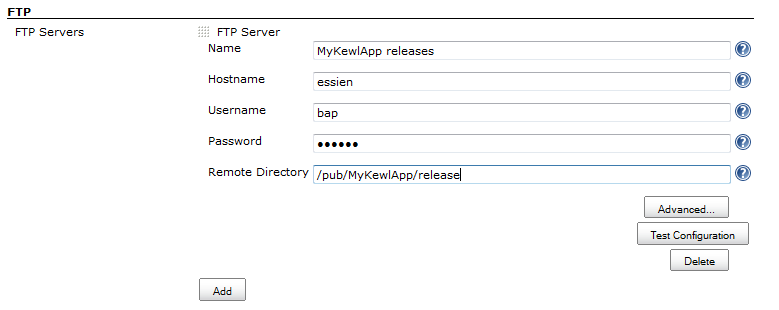
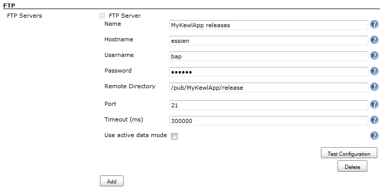
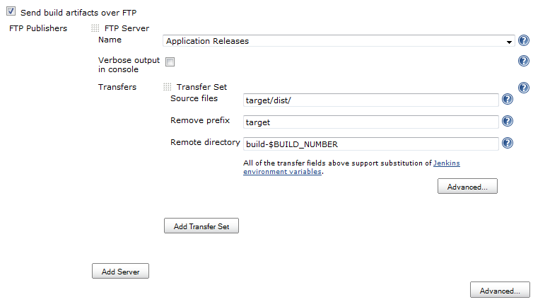
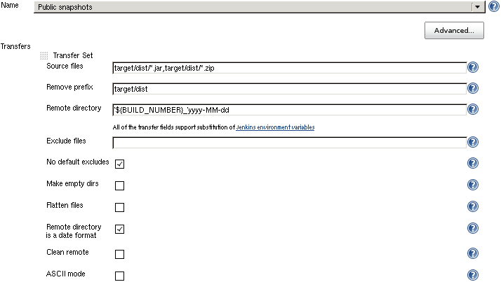
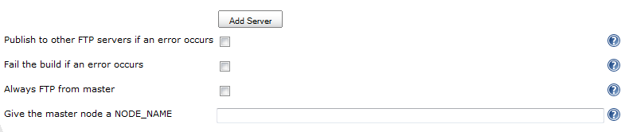
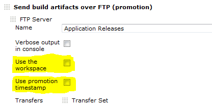

# Publish Over FTP Plugin for Jenkins

Send build artifacts over FTP.

## Publish Over Plugin

<!-- TODO: Update link once the Publish Over documentation is moved to GitHub -->

Please read [Publish Over Plugin](https://wiki.jenkins.io/display/JENKINS/Publish+Over) documentation first.
Common configuration options will not be repeated here.

## Features

-   Send files to FTP servers
-   The plugin is "promotion aware" see
    [Promotions](https://wiki.jenkins.io/display/JENKINS/Publish+Over#PublishOver-promotions)
-   Publish to multiple servers in the "Post-build Actions"
-   Transfer complete directory structures, partial structures or just
    files
-   Option to delete all files in the remote directory before publishing
-   Use passive (PASV) or active (PORT) transfers
-   FTP can be used as a build step during the build process
-   Passwords are encrypted in the configuration files and in the UI

## Configure

#### Create host configurations in the main Jenkins configuration

From the Jenkins home page, click "Manage Jenkins" and the click on
"Configure System"

Find the FTP section (as below) and click on the "Add" button next to
"FTP Servers"  

You should now have the configuration options as below  

Fill in Name, Hostname, Username, Password and Remote Directory. [see
Publish Over ... for common options for Host
Configurations](https://wiki.jenkins.io/display/JENKINS/Publish+Over#PublishOver-host)

##### Advanced

If you click the "Advanced..." button for a configuration, then you will
make more configuration options available (see below)  

[see Publish Over ... for common options for Host
Configurations](https://wiki.jenkins.io/display/JENKINS/Publish+Over#PublishOver-host)

###### Use active data mode

By default passive mode will be used to connect to the FTP Server.  
In passive mode the client initiates all connections which will allow
the client to send files through a firewall that has been configured to
refuse all inbound connections (and does not create dynamic rules).  
If you want to dissable passive mode, and have the client use PORT
commands for the server to connect to the client to retieve the files,
then you can check this box.

###### Don't make nested dirs

Do not try to create nested directories with a single MKD command  
The default behaviour when creating directories is to try to create the
target directory with single command, even if it is nested. If this
fails, the plugin will fall back to creating each directory
individually. Some FTP servers, when asked to create nested directories
will respond with a success code, but will not create the directories
correctly. This will result in directories being created in incorrect
branches of the directory tree.  
This option will not prevent the creation of nested directories, it is
just a fix for badly behaved FTP servers.

##### Click "Test Configuration".

##### Add more server configurations (if required)

##### Save

#### Configure a job to Publish Over FTP

Open a jobs main page and then click "Configure" from the left hand
menu.

Find the "Send build artifacts over FTP" checkbox in the "Post-build
Actions" section (as below) and click in the box.  

You should now have the configuration options as below  

[see Publish Over ... for common options for
Server](https://wiki.jenkins.io/display/JENKINS/Publish+Over#PublishOver-server)

[see Publish Over ... for common options for Transfer
Sets](https://wiki.jenkins.io/display/JENKINS/Publish+Over#PublishOver-transfer)

Source files

The build will fail if you do not select any Source files to transfer

##### Advanced (Transfer Sets)

If you click the "Advanced..." button for a Transfer Set, then you will
make more configuration options available (see below)

[see Publish Over ... for common options for Transfer
Sets](https://wiki.jenkins.io/display/JENKINS/Publish+Over#PublishOver-transfer)

###### ASCII mode

Transfer the files using ASCII mode.  
This means that during the transfer, new lines and carriage returns will
be converted from the format used on the client operating system to the
format used on the servers operating system.  
Do not use this option if your Source files pattern will match any
binary files, as there is a good chance that binary files will be
corrupted during transfer.

###### Clean remote

Delete all files and directories from the remote directory before
uploading the new files.

##### Advanced (Publisher)

If you click the "Advanced..." button that is immediately below the "Add
Server" button, then you will make more configuration options available
(see below)  

[see Publish Over ... for common options for
Publisher](https://wiki.jenkins.io/display/JENKINS/Publish+Over#PublishOver-publisher)

#### Options to override the default Promotion behaviour

If you are configuring an action in a promotion, new options will become
available.  

[see Publish Over ... for common options for
Promotions](https://wiki.jenkins.io/display/JENKINS/Publish+Over#PublishOver-promotions)

## Release Notes

See the [changelog](./CHANGELOG.md).
